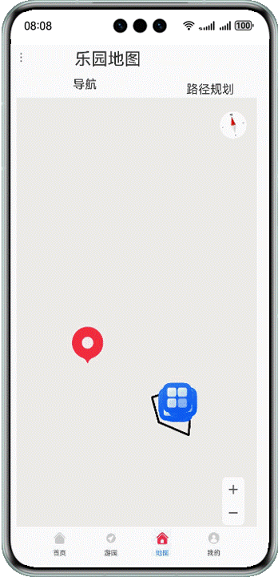

# 旅游类应用解决方案

## 简介

1. 基于common+feature+phone三层架构构建的出行类应用解决方案框架demo
2. 包含了首页、游园、地图、我的四个模块。使用Web、RDB数据库、定位、地图嵌入打点路径规划等功能
3. 包含了异形Tab页，特殊Tab展示效果的实现

## 效果预览

| 首页                                            |                      游园                      | 地图                                          | 我的                                           | 
|-----------------------------------------------|:--------------------------------------------:|---------------------------------------------|----------------------------------------------|
|  |  |  |  |

## 约束与限制

1. 本示例仅支持标准系统上运行，支持设备：华为手机。
2. DevEco Studio版本：DevEco Studio 5.0.1 Release及以上。
3. HarmonyOS SDK版本：HarmonyOS 5.0.1 Release SDK及以上。

## 使用说明

### 安装配置

在终端执行ohpm install @ohos/hamock

### 相关权限

ohos.permission.INTERNET

ohos.permission.APPROXIMATELY_LOCATION

ohos.permission.LOCATION

### MapKit部分

1. 需要在AGC配置应用并在model.json5中修改应用ID后开启地图服务才能够正常看到地图
2. 无法加载地图可能原因：无网络；未完成基本准备工作及指纹配置；未配置Client ID；地图权限未开通；应用身份校验失败。

## 实现思路

1. 首页公告使用WEB实现：使用web_webview加载html文件

```typescript
Web({ src: $rawfile("userIndex.html"), controller: this.controller })
```

2. 账号注册使用rdb数据库实现：使用relationalStore.RdbStore进行增删改查，登录时使用账户与数据库进行匹配，查询不到则需要注册

```typescript
rdbStore: relationalStore.RdbStore | null = null;
this.rdbStore.query(predicates, this.columns, (err, resultSet) => {
  callback(resultSet);
  resultSet.close();
});
```

3. 地图使用:MapComponent, mapCommon, map, navi
    1. 使用want调起华为地图应用
    2. 路径规划：使用navi API

```typescript
result = await navi.getDrivingRoutes(this.drivingRouteParams);
navi.DrivingRouteParams配置始末位置的经纬度等信息
```

3. 初始化地图

```typescript
MapComponent({ mapOptions: this.mapOption, mapCallback: this.callback });
  ```

4. 创建标记地点，记录旅游景区

```typescript
let marker3 = await this.mapController?.addMarker(markerOptions3) as map.Marker;
 ```

## 工程目录

```
common/src/main/ets/
|---components                     // 基础组件
|   |---LocalList.ets              // 本地生活列表组件
|---constants                      // 通用常量
|   |---BreakpointConstants.ets    // 断点
|   |---CommonConstants.ets        // 通用样式
|   |---PageConstants.ets          // 初始页面管理
|   |---StyleConstants.ets         // 全局常量管理
|---database                       // 数据库相关
|   |---tables                     // 主页model
|---|---|---AccountTable.ets       // 账户表
|   |---Rdb.ets                    // RDB数据库操作
|---utils                          // 通用工具类
|   |---BreakpointSystem.ets       // 断点系统管理
|   |---CommonDataSource.ets       // 通用数据管理
|   |---Logger.ets                 // 日志统一管理
|---viewmodel                      // 数据模型
|   |---AccountInfo.ets            // 账户model
|   |---ConstantsInterface.ets     // 账户表model
|   |---LocalDataModel.ets         // 本地生活model
|   |---MemberShipData.ets         // 交互数据源model

feature:
accountCenter/src/main/ets/
|---components                     
|   |---LoginPage.ets              // 登录页面
home/src/main/ets/
|---components                     
|   |---CustomDialogExample.ets    // 自定义弹窗
|   |---Home.ets                   // 首页
|   |---Notice.ets                 // 运营公告
|---viewmodel                     
|   |---HomeData.ets               // 首页数据
mapService/src/main/ets/
|---components                     
|   |---MainPage.ets               // 跳转华为地图
|   |---MapPage.ets                // 地图页
parkService/src/main/ets/
|---components               
|   |---CardPage.ets               // 卡包页
|   |---ParkVisiting.ets           // 游园页
|   |---TravelTips.ets             // 旅游攻略页
|---viewmodel                     
|   |---ParkingVistingData.ets     // 游园数据
personal/src/main/ets/
|---components  
|   |---AboutApp.ets               //关于页
|   |---AppSettingPage.ets         //设置页
|   |---MessagePage.ets            //消息页
|   |---Personal.ets               //个人中心
|   |---PersonalCenter.ets         //个人中心二级页面
|---viewmodel                     
|   |---IconButtonModel.ets        // 通用model
|   |---MineListModel.ets          // 个人数据model
|   |---PersonalData.ets           // 个人中心model
|   |---QuitLoginDialog.ets        // 退出登录弹窗

phone:
src/main/ets/
|---entryability
|   |---EntryAbility.ets
|---pages
|   |---MainPage.ets              // 首页
|   |---SplashPage.ets            // 开屏页面
|---utils                     
|   |---GlobalContext.ets         // 工具类
|   |---PreferencesUtil.ets       // 工具类
|---viewmodel                     
|   |---MainPageData.ets          // 主页model
```

## 模块依赖

无

## 参考文档

无

## ChangeLog

| 修改内容  |     时间     | 
|-------|:----------:|
| 规范化补充 | 2025.01.23 |


